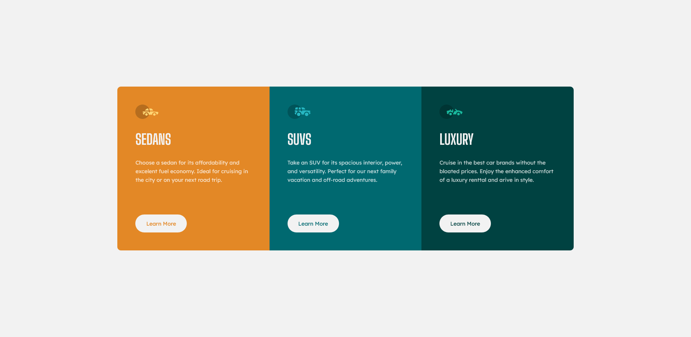

# Frontend Mentor - Stats preview card component solution

This is a solution to the [3-column preview card component challenge on Frontend Mentor](https://www.frontendmentor.io/challenges/3column-preview-card-component-pH92eAR2-). Frontend Mentor challenges help you improve your coding skills by building realistic projects. 

## Table of contents

- [Overview](#overview)
  - [The challenge](#the-challenge)
  - [Screenshot](#screenshot)
- [My process](#my-process)
  - [Built with](#built-with)
- [Author](#author)

## Overview

### The challenge

Users should be able to:

- View the optimal layout depending on their device's screen size
- See hover states for interactive elements

### Screenshot

### Links

- Solution URL: [GitHub](https://github.com/sergii-moroz/3-column-preview-card-component)

## My process

[YouTube](https://youtu.be/Gs5VWhNpz34)

### Built with

- HTML5
- SASS

## Author

- Website - [YouTube](https://youtu.be/Gs5VWhNpz34)
- Frontend Mentor - [link](https://www.frontendmentor.io/profile/sergii-moroz)
